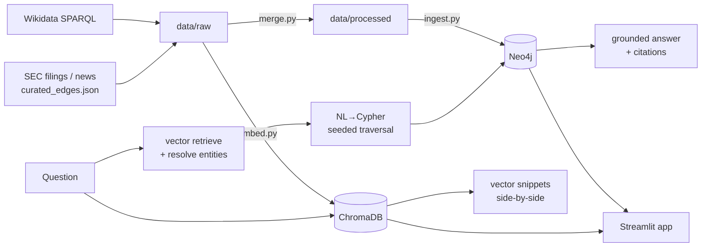

# OntoMarket

**Thesis:** Multi-hop graph reasoning over a financial ontology outperforms vector
search on relational questions — questions where the answer depends on traversing a
chain of relationships, not on finding a single matching document. OntoMarket doesn't
just retrieve the right nodes; it **synthesizes a grounded, cited natural-language
answer** from the traversal, where every claim points back to a specific graph edge.

## What this is

A focused GraphRAG demo built around one sector: big-tech / AI infrastructure
(~20 companies). The dataset is small by design — its purpose is to make the contrast
between graph reasoning and vector search legible, not to scale.

Ask a freeform question. OntoMarket:

1. **Retrieves** — vector search finds which entities the question is about, resolved
   to canonical tickers (the "retrieve" in retrieve-then-traverse).
2. **Traverses** — those entities seed a Cypher query (LLM-generated or a preset
   template) that walks the relationship chain in Neo4j.
3. **Synthesizes** — Claude writes a plain-English answer grounded *only* in the
   returned subgraph, citing the specific edges (`[3]`) that support each claim.
4. **Contrasts** — the same question runs against pure vector search side by side, so
   you can see what a document-similarity system returns instead — the pieces, never
   the composed chain.

**Stack:** Neo4j (Aura) · ChromaDB · sentence-transformers · Claude API · Streamlit ·
Cytoscape.js

## Dataset

| Entity / edge      | Count | Source                                             |
| ------------------ | ----- | -------------------------------------------------- |
| Company nodes      | 20    | Wikidata SPARQL                                    |
| Person nodes       | 48    | Wikidata + curated executive records              |
| Event nodes        | 16    | Hand-curated from SEC filings & verified news      |
| `COMPETES_WITH`    | 18    | Analyst reports, Gartner, market knowledge        |
| `SUPPLIES_TO`      | 14    | Company filings & press releases                  |
| `EXECUTIVE_OF`     | 24    | SEC Form 4 + curated cross-competitor moves       |
| `AFFECTED_BY`      | 19    | Event linkage with impact direction               |
| Vector snippets    | 91    | Hand-written / LLM-generated, embedded in ChromaDB |

Structural data (founding dates, sector classification) is pulled from Wikidata via
SPARQL. Executive moves, supply-chain links, and regulatory events are hand-curated
from public filings and verified news sources, each with a source URL. This is a
curated dataset, not an automated pipeline at scale — the README is upfront about that.

## Architecture

```
data/raw/          Wikidata SPARQL responses + hand-curated JSON (curated_edges.json)
data/processed/    Schema-validated nodes/edges ready for ingestion
data/eval/         Benchmark question set + saved run history

src/data/          Wikidata client, SEC Form 4 pull, LLM extractor, entity resolver,
                   schema validation, merge pipeline
src/graph/         Neo4j ingestion + Cypher query templates
src/search/        sentence-transformers embedding, ChromaDB ingestion + retrieval
src/query/         entity_seeder (vector→ticker anchors) · nl_to_cypher (NL→Cypher) ·
                   explainer (grounded cited answer synthesis) · router
src/eval/          Graph-vs-vector benchmark runner, scorer, snapshot diff
app.py             Streamlit UI
```

### Data flow



## Running the demo

### Prerequisites

- Python 3.11
- A Neo4j instance (Neo4j Aura free tier, or local) with its connection URI
- An Anthropic API key (for NL→Cypher and answer synthesis)

### 1. Environment

```bash
python3.11 -m venv venv
source venv/bin/activate
pip install -r requirements-local.txt
```

> `requirements.txt` (root) is only the Streamlit **redirect stub**'s dep — the
> old Streamlit app is retired and now forwards to the deployed React app. Local
> development uses `requirements-local.txt`; the deployed API image uses
> `requirements-api.txt`.

Copy `.streamlit/secrets.toml.example` and fill in credentials, or create a `.env`:

```
NEO4J_URI=neo4j+s://xxxx.databases.neo4j.io
NEO4J_USER=neo4j
NEO4J_PASSWORD=your-password
ANTHROPIC_API_KEY=sk-ant-...
```

> **Note:** use the project `venv` for everything. A system Python (e.g. Anaconda)
> may have a conflicting `protobuf`/`transformers` that breaks `sentence-transformers`.

### 2. Build the data

```bash
python -m src.data.merge          # data/raw → data/processed (schema-validated)
python src/graph/ingest.py        # load nodes + edges into Neo4j (idempotent)
python src/search/embed.py        # embed snippets into ChromaDB
```

### 3. Run

```bash
streamlit run app.py
```

Pick a preset question or type a freeform one, and hit **Run**.

### Benchmark

Compare graph vs. vector retrieval on the eval question set:

```bash
python -m src.eval.run_eval               # comparison table
python -m src.eval.run_eval --save        # + save a timestamped snapshot
python -m src.eval.diff_history --latest-two   # diff two saved runs
```

### Tests

```bash
venv/bin/python -m pytest tests/ -v
```

## Deploying

The app runs on Streamlit Community Cloud. ChromaDB rebuilds itself from
`data/raw/vector_snippets.json` on first run (the `chroma_db/` dir is gitignored), so
**vector search needs no external infra**. The only external dependency is Neo4j.

**1. Stand up a Neo4j instance.** Any reachable Neo4j works — a managed AuraDB free
instance, or self-hosted Neo4j Community on a free container host (Fly.io keeps it
always-on; Render/Railway free tiers sleep on inactivity, which is a poor fit for a
share-a-link demo). You need its Bolt URI and credentials.

**2. Seed the graph.** A fresh Neo4j instance is empty. Ingestion is idempotent
(`MERGE`, not `CREATE`), so point your `.env` at the new instance and run:

```bash
venv/bin/python -m src.data.merge      # raw → processed (if not already built)
venv/bin/python src/graph/ingest.py    # loads 20 companies, 48 persons, 75 edges
```

**3. Set secrets on Streamlit Cloud.** In the app's **Settings → Secrets**, add the
same four keys as local `.env` (`NEO4J_URI`, `NEO4J_USER`, `NEO4J_PASSWORD`,
`ANTHROPIC_API_KEY`) — the app reads env first, then falls back to `st.secrets`.

**4. Deploy / wake.** Push to the connected GitHub repo; Streamlit redeploys
automatically. A sleeping app (Community Cloud sleeps after ~7 days idle) is woken from
the dashboard.

> **Gotchas:** (a) if the Neo4j instance is asleep, the app boots but every query
> errors with a connection failure — wake the graph *before* the app. (b) `chroma_db/`,
> the local `.env`, and `data/processed/` are gitignored; the deploy rebuilds Chroma
> from the tracked snippets file, but the **graph must be seeded manually** (step 2) —
> it is not repopulated automatically on deploy.

## Results

Five benchmark questions, each traversing a relationship chain no single document
contains. `V-recall` is how many expected entities appear across the top-5 vector
snippets; `V-chain` is whether any *single* snippet contains the full answer chain
(the multi-hop test vector search fundamentally can't pass).

| Question (hops)                        | Graph recall | Vector recall | Vector chain | Why graph wins |
| -------------------------------------- | ------------ | ------------- | ------------ | -------------- |
| Hero — supply exposure via exec move (4) | 100%       | 100%          | **0%**       | Vector mentions the pieces (MSFT, AAPL, NVDA) but never composes "MSFT affected → exec moved to competitor AAPL → NVDA supplies MSFT" in one place. |
| Exec move → competitor event (3)       | 33%          | 67%           | **0%**       | Requires date-ordered traversal: who left, confirm they joined the competitor, then events at the competitor *after* the move. |
| Reverse supply exposure (2)            | 67%          | 100%          | **0%**       | Vector finds "NVDA faces export controls" and "TSM supplies NVDA" as separate snippets but can't join them into supply-chain exposure. |
| Competitor events (2)                  | 100%         | 50%           | **0%**       | Vector can't guarantee it retrieved *all* of INTC's graph-defined competitors. |
| Supply-chain map (1)                   | 100%         | 67%           | **0%**       | Vector has no concept of "all" suppliers — it returns a similar subset, not the complete set. |

**The headline finding:** `V-chain` is **0% on every question, including the 1-hop
case**. Vector search can surface the individual facts, but it never assembles them
into one coherent answer — because relationships aren't a property of any single
document. That's the gap OntoMarket's graph synthesis fills, verifiably: each answer
cites the exact edges it used.

> Recall numbers depend on `top_k` — see `data/eval/` for the exact run. Entity
> matching is alias-aware (a snippet saying "Nvidia" counts as an "NVDA" mention),
> so the vector baseline is scored generously.

**Worked examples:** [`docs/results.md`](docs/results.md) walks three real queries
side by side — the exact vector snippets, the graph traversal, and the cited answer
OntoMarket synthesized (all verbatim from live runs).

## Why this matters

- **Prometheux** — ontology beats vector for multi-hop financial reasoning.
- **Neo4j** — real Cypher traversals, schema design, constraint enforcement.
- **Glean / Tacnode** — grounded, cited answers over an enterprise knowledge graph.

Built with Python · Neo4j · Cypher · Claude API · ChromaDB · sentence-transformers ·
Streamlit.
