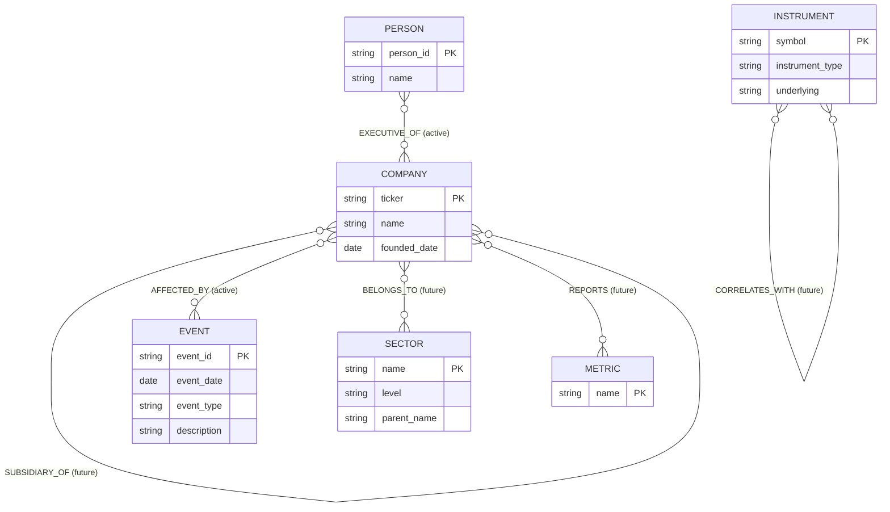

# MarketGraph Ontology Schema (Phase 1)

## Scope of this document

Every entity type from the original project plan is retained here, fully specified, for future scaling. Relationship types split into two tiers: active relationships are implemented and populated in the MVP graph starting in Phase 4. Future relationships are fully specified now so the schema doesn't need rework later, just new edges.

## Entity Types

### Company (active)

| Property | Type | Notes |
|---|---|---|
| ticker | string (PK) | Canonical identifier, resolved from name variants in Phase 3 |
| name | string | Display name |
| founded_date | date | |

Sector and industry classification is not a flat property here. It's handled by the future BELONGS_TO relationship to Sector below, so the same fact isn't stored twice once Sector exists as its own node.

### Person (active)

| Property | Type | Notes |
|---|---|---|
| person_id | string (PK) | Internal key, avoids collisions if two executives share a name |
| name | string | |

Role history doesn't live on Person. It lives on the EXECUTIVE_OF relationship below, since one person can hold roles at multiple companies over time, each with its own dates.

### Event (active)

| Property | Type | Notes |
|---|---|---|
| event_id | string (PK) | |
| event_date | date | |
| event_type | string (enum) | earnings_call, merger, lawsuit, regulatory_filing, leadership_change |
| description | string | Short summary |

### Sector (future)

| Property | Type | Notes |
|---|---|---|
| name | string (PK) | |
| level | string (enum) | industry, sector, sub_sector |
| parent_name | string, nullable | Hierarchy pointer; becomes a real relationship once a hierarchy edge ships |

Covers what the original plan called "Sector / Industry," modeled as one entity type with a level property rather than three separate node types.

### Instrument (future)

| Property | Type | Notes |
|---|---|---|
| symbol | string (PK) | |
| instrument_type | string (enum) | stock, bond, derivative |
| underlying | string, nullable | Ticker or symbol it derives from; becomes a relationship once CORRELATES_WITH ships |

### Metric (future)

| Property | Type | Notes |
|---|---|---|
| name | string (PK) | revenue, pe_ratio, debt_to_equity, etc. |

Kept intentionally thin. Time-series values (date, value) live on the REPORTS edge connecting a Company to a Metric, not on the Metric node, so one "revenue" node serves every company's revenue history.

## Relationship Types

### Active (implemented in MVP)

| Relationship | Connects | Direction | Properties | Notes |
|---|---|---|---|---|
| COMPETES_WITH | Company → Company | Symmetric | none | |
| SUPPLIES_TO | Company → Company | Directional | category (optional) | Covers "customer of" too; that's the same edge read backward. No separate inverse relationship type, so the fact isn't stored twice. |
| EXECUTIVE_OF | Person → Company | Directional | start_date, end_date (nullable), title | Multiple edges per person over a career |
| AFFECTED_BY | Company → Event | Directional | impact (positive, negative, neutral) | |

### Future (defined, not implemented)

| Relationship | Connects | Notes |
|---|---|---|
| BELONGS_TO | Company → Sector | Hierarchical classification |
| SUBSIDIARY_OF | Company → Company | Corporate structure |
| REPORTS | Company → Metric | Time-series edge; date and value live here, not on Metric |
| CORRELATES_WITH | Instrument → Instrument | correlation_coefficient property |

## Entity-Relationship Diagram

## Schema Validation: Sample Scenarios

1. **Hero query.** Which companies are exposed to supply chain risk if Company X has a regulatory event, given executives who moved from X to its competitors in the last two years? Traverses AFFECTED_BY (Event → X), COMPETES_WITH (X → Y), EXECUTIVE_OF (Person → X in the past, Person → Y currently), and SUPPLIES_TO (X → Z). Uses all four active relationships in one chain.

2. **Simpler three-hop check.** An executive left Company A for a direct competitor last year. Has that competitor had a notable event since the move? Traverses EXECUTIVE_OF (past and current), COMPETES_WITH, and AFFECTED_BY. A good sanity check to run before the full hero query.

3. **Reverse traversal check.** If Company A faces a regulatory action, which of its suppliers face downstream exposure? Traverses AFFECTED_BY plus SUPPLIES_TO read backward (any X where X → A). Confirms the directional edge doesn't need a separate inverse relationship type to answer this.

4. **Why Sector earns its place.** Which other companies in the same sector as Company A should be benchmarked against it? Requires BELONGS_TO (Company → Sector). Not answerable in the MVP, but the schema doesn't change shape when that edge ships, since Sector is already a fully specified node.

5. **Why Metric and Instrument earn their place.** Did Company A's revenue shift in the quarter after its leadership change, and how did its related equity or derivative instruments respond? Requires REPORTS (Company → Metric) and CORRELATES_WITH (Instrument → Instrument). Same logic: not answerable now, but the entity types are already there waiting for the edges.